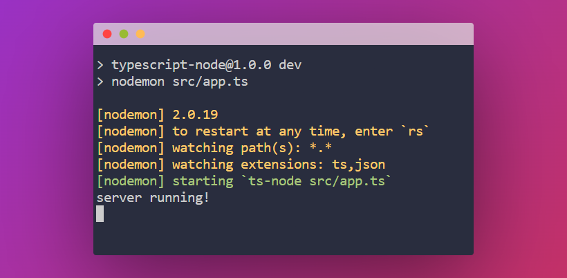

# Node-TypeScript Environment

A TypeScript, Node and express backend server Project template to speed up the initial steps of development.

## Screenshots

## Covered Concepts

This repo is a startup environment for project to begin with TypeScript setup using node and express

## Prerequisites

The things you need before installing the website source code.

- You need to have basic knowledge of Node, TypeScript and express
- And you need to have concept of backend basics.
- Oh, and don't forget to have VS code and node installed (you can use other editors as well)

## Built with

- 
- 
- 

## Feedback

If you have any feedback, please reach out to us at abdulwaheed@ieee.org

## 🔗 Links

